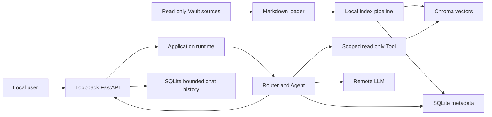

# Interview Agent Threat Model

## Executive summary

最高风险集中在三个边界：本地敏感 Markdown 进入远端 LLM，本地单用户 FastAPI 被错误地扩展为网络服务，以及未来启用的外部搜索接收用户查询并返回不可信链接。当前默认 loopback、固定单 Tool、来源白名单、提示词数据包络、引用校验、简历脱敏和无正文审计追踪显著降低了风险。v0.3.2 关闭了运行时写入路径与只读数据源重叠的配置缺口；v0.5.0 新增可删除、有限保留的本地聊天正文，因此 SQLite 也成为明确的敏感数据资产；v0.5.4 只建立默认未配置提供方的外部证据协议，不产生真实搜索。没有 Critical/High 威胁；完整 DLP、认证、请求级网络防护、真实搜索供应方治理和同账户本地明文读取在当前使用模型下是有条件的 Medium/Low 残余风险。

## Scope and assumptions

- 范围：`src/interview_agent/` 的运行时、API、Agent、Tool、Retrieval、LLM、SQLite、Chroma；测试、配置和发布边界。
- 已由用户确认：Windows 本机、单用户自用、不对公网开放、无多租户、Vault 含敏感笔记/项目/简历。
- 远程 LLM：产品运行时可选；本轮审查和验收不调用。未来每次真实验收仍需明确批准费用和外发范围。
- 外部搜索：v0.5.4 默认未配置提供方，只用合成替身验证协议；真实 provider、endpoint、网络调用、抓取和外部内容合成均需新的用户批准和安全复审。
- Embedding：本地 FastEmbed；首次可下载公开模型，真实资料正文不发送到 Embedding 远端服务。
- 信任：当前 Markdown 由用户本人维护，但其正文仍按不可信提示输入处理。
- 范围外：操作系统账户已被攻破、供应方内部安全、磁盘硬件攻击、多人权限系统、生产公网部署和 Phase 2 检索质量优化。
- 会改变评级的条件：绑定到非 loopback、共享给其他用户、摄入自动抓取或他人文档、更换远端 LLM/Embedding 服务、开启自动写回。

## System model

### Primary components

- 本地 HTTP 入口：FastAPI 的聊天页、`/health`、`/ask`、历史 CRUD、令牌停止入口和开发文档；证据锚点：`src/interview_agent/main.py`、`src/interview_agent/api/*.py`。
- 应用运行时：延迟创建本地模型、SQLite、Chroma、三只读 Tool 和 LLM 客户端，并串行执行；证据锚点：`src/interview_agent/application/runtime.py:58-258`。
- Router/Agent：确定性选择零个或一个 Tool，构造受限提示词，校验引用和输出；证据锚点：`src/interview_agent/agent/knowledge_agent.py:121-453`。
- 数据源加载与索引：只读扫描三个互斥 Markdown 目录，切分、Embedding、增量写入 SQLite/Chroma；证据锚点：`src/interview_agent/retrieval/markdown.py:55-210`、`src/interview_agent/retrieval/vector_index.py`。
- 本地存储：SQLite 的索引/审计表保存状态和无正文摘要，独立聊天表保存有限问题、已校验回答和展示引用；Chroma 保存证据正文、向量和相对引用元数据；证据锚点：`src/interview_agent/storage/*.py`。
- 远端 LLM：通过 OpenAI-compatible HTTPS Chat Completions 接口发送一次有界请求；证据锚点：`src/interview_agent/llm/openai_compatible.py`。
- 外部证据：本地服务先过滤并预览自包含的普通知识查询，提供方存在且用户确认后最多搜索一次；结果以临时 `[W]` 卡片显示，不进入 Agent 或存储；证据锚点：`src/interview_agent/application/external_search.py`、`src/interview_agent/api/external_search.py`。
- 开发与验收：pytest 使用替身和临时目录；真实 Vault 验收强制本地 Embedding、拒绝 LLM、比较前后指纹；证据锚点：`src/interview_agent/acceptance/real_vault.py`、`tests/test_real_vault_acceptance.py`。

### Data flows and trust boundaries

- 本机用户 -> FastAPI：问题、可选面试记录和 session UUID 经 loopback HTTP/JSON 进入；Pydantic 禁止额外字段，Agent 再做字符和长度校验；没有认证，安全保证依赖 loopback 与本机账户。
- Vault 文件系统 -> Markdown Loader：Markdown 字节经本地文件读取进入内存；真实路径、数据源白名单、扩展名、单文件/总量和 UTF-8 均确定性校验。
- Loader -> SQLite/Chroma：文档状态、片段正文、向量和相对引用元数据写入本地运行时目录；v0.3.2 在任何写入前拒绝运行时路径与数据源重叠。
- Agent -> Tool/Chroma：确定性 Router 固定 namespace，调用方不能提供路径、namespace 或任意查询表达式；只返回有界 Top-K。
- Agent -> 远端 LLM：脱敏问题和有界证据经 HTTPS JSON 发送；httpx 禁止环境代理和重定向；简历证据脱敏，但 notes/projects 仍可能包含私人自由文本。
- Agent -> SQLite Trace：只写 trace/session/tool/LLM ID、状态、耗时、长度和引用 ID；不写问题、记录、证据或回答正文。
- API -> SQLite History：默认保存当前问题、已校验回答、稳定状态和展示引用；不保存证据正文、完整 Vault、提示词、密钥、`interview_record`、`previous_question` 或内部片段标识，并受时间/数量清理和显式删除约束。
- Agent -> 本机用户：回答、相对引用和安全错误经 JSON 返回；输出校验阻止未知引用、外部链接和绝对路径，但不是完整语义 DLP。
- 本机用户 -> 外部搜索提供方：只有普通知识查询经本地敏感数据、个人上下文和 namespace 策略通过，并在界面展示实际文本、取得确认后才可发送；不附带本地证据、会话历史、项目、简历或面试记录。v0.5.4 默认没有该网络边。
- 外部搜索提供方 -> 本机用户：标题、摘要、公共 HTTPS URL 和提供方自报类型经数量、文本、域名、端口、凭据与敏感参数过滤后，用纯文本临时展示；不进入 SQLite、`/ask` 或 LLM，来源类型不等于事实核验。
- Stop script -> FastAPI：Git 忽略 PID 文件中的随机令牌经自定义请求头进入隐藏停止入口；PID、进程映像和启动时间匹配后才发起，错误令牌统一返回 404。

#### Diagram

## Assets and security objectives

| Asset | Why it matters | Security objective (C/I/A) |
|---|---|---|
| notes/projects/resume Markdown | 含个人知识、项目事实、面试记录和简历隐私；必须保持原文权威 | C/I/A |
| LLM API 密钥 | 泄漏会造成费用、配额和账户滥用 | C/I |
| Chroma 片段正文和向量 | 可反推出私人资料并影响检索证据 | C/I/A |
| SQLite 元数据、追踪和聊天历史 | 决定增量索引、引用定位和审计关联；聊天表含问题与回答正文 | C/I/A |
| Agent 系统规则和 Tool 白名单 | 防止提示注入改变权限或制造写入 | I |
| 引用与回答 | 影响个人经历真实性和面试准备质量 | I |
| Embedding 模型和依赖 | 被替换会影响检索完整性或执行本地恶意代码 | I/A |
| 本机算力和远端调用预算 | 滥用会造成卡死、延迟或费用 | A |
| 外部搜索查询、结果和点击目标 | 查询可能含隐私；结果可能误导、跟踪或引向恶意页面 | C/I/A |

## Attacker model

### Capabilities

- 能构造 `/ask` 问题或面试记录；当前现实前提是本机用户本人，条件场景是服务被错误暴露后出现网络调用者。
- 能在被索引的 Markdown 中放置提示注入、相似但错误的事实或隐私诱导文本；当前资料主要由用户本人维护。
- 恶意或异常远端 LLM 可以返回畸形 JSON、伪造引用、链接、绝对路径或超大响应。
- 未来真实外部搜索提供方可以记录查询，返回恶意/误导标题摘要、伪造来源类型或危险链接。
- 拥有同一 Windows 账户文件权限的本地进程可以读取或篡改运行时文件和环境配置。
- 依赖源、模型下载源或未来更新可能被供应链攻击。

### Non-capabilities

- 当前没有可从公网直接访问的默认监听地址。
- HTTP 请求不能指定 Tool、namespace、文件路径、SQL、Chroma filter 或系统命令。
- 文档正文不能直接执行代码、写文件或修改 Agent 工具表。
- 远端 LLM 响应只作为文本和引用候选校验，不作为命令、路径或数据库查询执行。
- 不假设攻击者已经取得 Windows 管理员权限；若本机账户完全失守，本项目级控制不能保护同账户明文数据。

## Entry points and attack surfaces

| Surface | How reached | Trust boundary | Notes | Evidence (repo path / symbol) |
|---|---|---|---|---|
| `POST /ask` | loopback HTTP JSON | 用户 -> FastAPI | 无认证；字段严格，长度在 Agent 层限制 | `src/interview_agent/api/ask.py:15-152` |
| `GET/DELETE /api/history` | loopback HTTP JSON | 用户 -> History Store | 有限正文；同源 UI；逐会话/全部删除 | `src/interview_agent/api/history.py` |
| `POST /api/system/shutdown` | loopback HTTP + 随机令牌 | Stop script -> Server | 不进 OpenAPI；错误令牌 404；回调仅设置 Uvicorn 退出标记 | `src/interview_agent/api/system.py` |
| `POST /api/external-search/preview` | loopback HTTP JSON | 用户 -> Local policy | 本地预览；字段严格；不调用提供方；响应不缓存 | `src/interview_agent/api/external_search.py` |
| `POST /api/external-search` | loopback HTTP JSON | 用户 -> Optional provider | 重新计算策略和确认文本；默认 503；配置后最多一次调用 | `src/interview_agent/api/external_search.py`、`application/external_search.py` |
| `.env`/环境变量 | 进程启动 | 本机配置 -> Runtime | 包含密钥、路径、模型和阈值 | `src/interview_agent/core/config.py:11-272` |
| Markdown 源目录 | 本地文件系统 | Vault -> Loader | 真实路径、白名单、大小和 UTF-8 校验 | `src/interview_agent/retrieval/markdown.py:55-210` |
| 本地模型缓存 | FastEmbed 延迟加载 | 包下载/缓存 -> 进程 | 只接受 FastEmbed 支持模型 | `src/interview_agent/retrieval/fastembed_provider.py:44-140` |
| Chroma 持久化 | 本地目录 | Index/Tool -> Store | 保存正文；遥测关闭；元数据严格解码 | `src/interview_agent/storage/chroma.py:35-345` |
| SQLite | 本地数据库文件 | Runtime/UI -> Store | 参数化查询；审计无正文，聊天正文有限保留并可删除 | `src/interview_agent/storage/*.py` |
| LLM Chat Completions | HTTPS POST | Agent -> Provider | 密钥、问题和证据跨出本机 | `src/interview_agent/llm/openai_compatible.py` |
| LLM 响应 | HTTPS JSON | Provider -> Agent | 大小、结构、完成原因、引用和链接校验 | `src/interview_agent/llm/openai_compatible.py`、`agent/knowledge_agent.py` |
| 真实 Vault 验收 CLI | 显式本地命令 | Operator -> Acceptance | 读取真实源，写匿名本地报告；禁止 LLM | `src/interview_agent/acceptance/real_vault.py` |
| 依赖安装 | pip/build | Package index -> 环境 | 版本区间，无仓库 lockfile | `pyproject.toml:1-27` |

## Top abuse paths

1. 攻击者让服务绑定到非 loopback -> 调用无认证 `/ask` -> Router 检索私人资料 -> 获得回答并消耗 LLM 预算。
2. 不可信 Markdown 植入“忽略规则并泄漏资料” -> 片段被高分召回 -> 远端 LLM遵循恶意语义 -> 输出格式仍合法但内容越界。
3. 操作者把 SQLite/Chroma/缓存配置进数据源 -> 运行时创建文件或后续清理目录 -> 破坏只读原文；v0.3.2 在写入前阻断该路径。
4. 恶意远端供应方返回伪造 `[S99]`、外部链接或本机路径 -> Agent 输出校验拒绝 -> 返回稳定错误而非传播内容。
5. 本机恶意进程篡改 Chroma 正文或元数据 -> Tool 读取污染证据 -> 严格元数据/引用身份校验阻断部分损坏，但语义正确性仍可能被污染。
6. 依赖或模型供应链发布恶意/回归版本 -> 宽版本安装获得新构件 -> 在本地进程权限内执行或改变检索；当前通过主版本上限、支持模型目录和发布测试降低概率。
7. 网络攻击者发送超大 JSON -> ASGI 先解析请求 -> Agent 长度校验发生较晚 -> 消耗内存；当前 loopback-only 使概率低。
8. 同账户进程读取 SQLite -> 获得本地聊天问题和回答 -> 暴露用户学习/求职内容；当前依赖 Windows 账户权限、Git 忽略、有限保留和用户删除降低范围，但没有应用层加密。
9. 同账户进程窃取 `.run` 停止令牌 -> 请求隐藏 shutdown 入口 -> 造成可恢复的本地服务中断；不会获得 Vault 或密钥，正常下次启动可恢复。
10. 用户把个人上下文或凭据写入外部查询，或提供方返回追踪/恶意链接 -> 本地策略、显式确认、URL 过滤和纯文本分区降低风险；识别不是完整 DLP，真实提供方启用后仍可能保留安全查询，用户主动点击的公共 HTTPS 页面也离开本应用信任边界。

## Threat model table

| Threat ID | Threat source | Prerequisites | Threat action | Impact | Impacted assets | Existing controls (evidence) | Gaps | Recommended mitigations | Detection ideas | Likelihood | Impact severity | Priority |
|---|---|---|---|---|---|---|---|---|---|---|---|---|
| TM-001 | 配置失误或本机操作者 | 可修改运行时路径配置 | 把 SQLite、Chroma 或模型缓存与只读源重叠 | 污染或误删原始资料 | Markdown、索引 | v0.3.2 写入前双向重叠检查；5 个对抗测试 | 校验后的本地 TOCTOU | 保持该检查为启动硬门槛；清理前继续解析和核对绝对路径 | 启动失败码；Vault 前后指纹 | Low | High | low |
| TM-002 | 不可信 Markdown 或问题 | 恶意文本被召回并送到 LLM | 用提示注入诱导泄漏、越权叙述或虚构事实 | 私人信息或回答完整性受损 | Markdown 隐私、回答、引用 | 固定系统提示、JSON 包络、单 Tool、简历/问题脱敏、引用/链接/路径校验 | 没有完整语义 DLP和逐句蕴含验证 | 当前接受；边界变化时加入数据外带意图检测、输出 DLP 和事实蕴含校验 | 记录拒绝原因和异常引用率，不记录正文 | Low | High | medium |
| TM-003 | 网络调用者 | 服务被错误绑定到 LAN/公网 | 调用无认证 `/ask` 检索资料和消耗费用 | 数据披露、费用、可用性 | Vault 派生回答、API 预算 | 默认 `127.0.0.1`、固定 Tool 和输入上限 | `create_app` 无认证，外部 Uvicorn 可改 host | 一旦共享，增加认证、host/Origin 策略、请求上限和速率限制 | 监听地址启动检查、访问日志和费用告警 | Low | High | medium |
| TM-004 | 远端 LLM或错误供应方配置 | 用户启用真实 LLM | 接收问题和最小证据，或供应方保留数据 | 敏感资料外发 | 问题、证据、密钥 | HTTPS-only remote、loopback-only HTTP、`trust_env=False`、无重定向、简历脱敏、片段预算 | notes/projects 自由文本没有完整 DLP；供应方治理在项目外 | 每次真实验收明确批准；维持数据最小化；更换供应方前复审 | token/请求 ID/费用记录，不记录正文 | Medium | High | medium |
| TM-005 | 同账户本地进程 | 能写 SQLite/Chroma | 篡改索引、状态或证据正文 | 错误引用、拒答或虚构支持 | Chroma、SQLite、回答 | 严格元数据解码、索引配置指纹、引用映射 | 无文件签名或加密认证 | 共享设备时增加 ACL、磁盘加密和重建命令；必要时校验存储清单 | 索引指纹变化、异常重建和解码错误 | Low | Medium | low |
| TM-006 | 依赖/模型供应链 | 重新安装或首次模型下载 | 投递恶意或回归构件 | 本机代码执行、检索完整性下降 | 源码环境、模型、Vault 可读权限 | 主版本上限、FastEmbed 支持模型列表、CPU provider、离线模式、测试 | 无 lockfile/SBOM/哈希 | 在 CI/分发前锁定依赖并记录模型工件摘要 | 安装清单 diff、依赖扫描、模型指纹 | Low | High | low |
| TM-007 | 网络或本机调用者 | 能向 API 发送请求 | 发送大请求或高频请求，占用串行运行时和 LLM预算 | 延迟、内存、费用 | 可用性、预算 | Agent 字符上限、一次 Tool/LLM、超时、有限重试、串行锁 | 请求体在解析前无字节上限；无速率限制 | 仅在共享/公网时由代理或中间件限制 body/rate/concurrency | 请求大小、429、队列时间和费用告警 | Low | Medium | low |
| TM-008 | 同账户本地进程或备份读取者 | 可读取运行时 SQLite | 读取聊天问题、回答和展示引用 | 学习、求职和个人上下文披露 | 聊天历史 | Git 忽略；有限时间/数量；逐会话/全部删除；不保存证据正文、面试记录或密钥 | 无应用层加密；无独立目录 ACL | 共享设备关闭历史或使用系统磁盘加密；备份前清理；多人场景重新设计权限 | 历史配置与数据库备份清单 | Low | Medium | low |
| TM-009 | 同账户本地进程 | 可读取 `.run` 或调用 loopback | 窃取令牌并停止服务 | 可恢复的本地可用性中断 | 本地服务 | 128-bit 随机令牌；Git 忽略；隐藏接口；错误令牌 404；正常退出清理 PID 文件 | 同账户恶意进程本就能终止用户进程 | 保持单用户边界；多人/服务化时改用 OS 服务控制和 ACL | 非预期 shutdown 与启动日志 | Low | Low | low |
| TM-010 | 查询内容、真实搜索提供方或结果页面 | 用户启用真实 provider 并确认查询或点击结果 | 保留敏感查询、返回误导/恶意链接、伪造来源类型，或通过直接 API 绕过界面确认消耗预算 | 隐私披露、错误学习、跟踪、费用或跳转风险 | 外部查询、浏览器、预算、回答完整性 | 默认无 provider；只允许普通知识；常见隐私/凭据失败关闭；精确查询确认；一次调用无自动重试；有界公共 HTTPS；`[W]` 分区、未核验标签、`no-referrer`、零持久化 | 不是完整 DLP；UI 确认不是 API 认证；未验证 DNS/重定向/供应方保留和页面安全；来源类型由提供方自报 | 接入前独立批准和适配器安全设计；限制 endpoint/超时/响应/并发/费用；必要时使用一次性确认许可；建立来源域策略和审计摘要 | 不含正文的调用数、拒绝原因、提供方请求 ID、费用和危险候选计数 | Low（默认关闭） | Medium | medium |

## Criticality calibration

- Critical：当前本地边界下可在无本机权限前提直接远程执行代码、读取完整 Vault 或窃取 API 密钥；或默认配置即可不可恢复地批量破坏原文。例：默认公网未认证的任意文件读取；Markdown 直接触发系统命令；启动即递归删除 Vault。当前未发现。
- High：需要有限前提即可泄漏大量简历/笔记、稳定绕过来源边界或造成显著远端费用。例：loopback 服务实际被发布到公网且可枚举完整资料；任意 namespace/path 参数绕过；密钥进入错误响应。当前未发现默认成立项。
- Medium：依赖部署边界改变、恶意文档被召回或错误供应方配置，可能造成部分隐私披露、事实污染或费用。TM-002、TM-003、TM-004、条件性的 TM-010 属于此级。
- Low：需要同账户权限、明显配置失误或易恢复的本地 DoS，且已有硬控制或重建路径。TM-001 修复后的残余风险、TM-005、TM-006、TM-007、TM-008、TM-009 属于此级。

## Focus paths for security review

| Path | Why it matters | Related Threat IDs |
|---|---|---|
| `src/interview_agent/application/runtime.py` | 所有可写存储、模型和 LLM 的组装及路径边界 | TM-001, TM-004, TM-007 |
| `src/interview_agent/retrieval/markdown.py` | Vault 白名单、符号链接、大小和只读加载 | TM-001, TM-002 |
| `src/interview_agent/agent/knowledge_agent.py` | Tool 调用上限、LLM 输入和最终输出校验 | TM-002, TM-003, TM-004 |
| `src/interview_agent/agent/prompts.py` | 不可信文档的数据/指令分界 | TM-002 |
| `src/interview_agent/core/privacy.py` | 当前个人数据和本机路径脱敏覆盖面 | TM-002, TM-004 |
| `src/interview_agent/llm/openai_compatible.py` | 密钥、HTTPS、超时、重试、响应大小和错误脱敏 | TM-004, TM-007 |
| `src/interview_agent/api/ask.py` | 无认证 HTTP 入口和响应暴露 | TM-003, TM-007 |
| `src/interview_agent/storage/chroma.py` | 私人正文持久化、遥测和损坏元数据处理 | TM-005 |
| `src/interview_agent/storage/agent_trace.py` | 审计数据是否意外保存正文或路径 | TM-004, TM-005 |
| `src/interview_agent/storage/conversation_history.py` | 聊天正文最小化、保留期、删除和绝对引用边界 | TM-005, TM-008 |
| `src/interview_agent/api/history.py` | 本地正文读取和删除接口 | TM-003, TM-008 |
| `src/interview_agent/api/system.py`、`scripts/*.ps1` | 停止令牌、PID 身份和可用性边界 | TM-009 |
| `src/interview_agent/application/external_search.py`、`api/external_search.py` | 外发策略、显式确认、提供方调用上限、候选 URL 和零持久化边界 | TM-003, TM-007, TM-010 |
| `src/interview_agent/acceptance/real_vault.py` | 真实 Vault 指纹、匿名报告和运行时写入隔离 | TM-001, TM-002 |
| `pyproject.toml` | 依赖安装与供应链复现性 | TM-006 |

## Quality check

- [x] 覆盖 HTTP、配置、文件系统、Embedding、SQLite、Chroma、LLM、可选外部搜索和验收入口。
- [x] 每个主要信任边界至少映射到一个威胁。
- [x] 区分运行时、开发/测试和供应链。
- [x] 使用用户已确认的单机单用户、无公网、敏感 Vault 上下文校准评级。
- [x] 明确输出语义 DLP、认证、请求预限流和依赖锁定的条件性结论。
- [x] 没有读取或输出 `.env`、真实 Vault 正文、SQLite/Chroma 正文或真实密钥。
